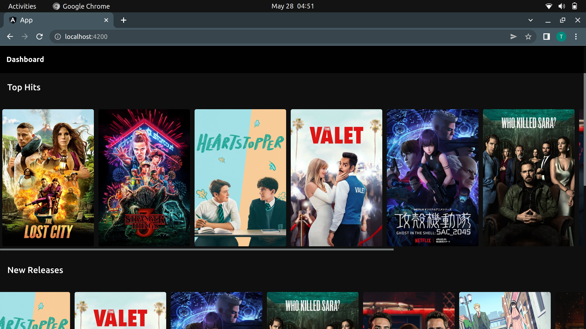
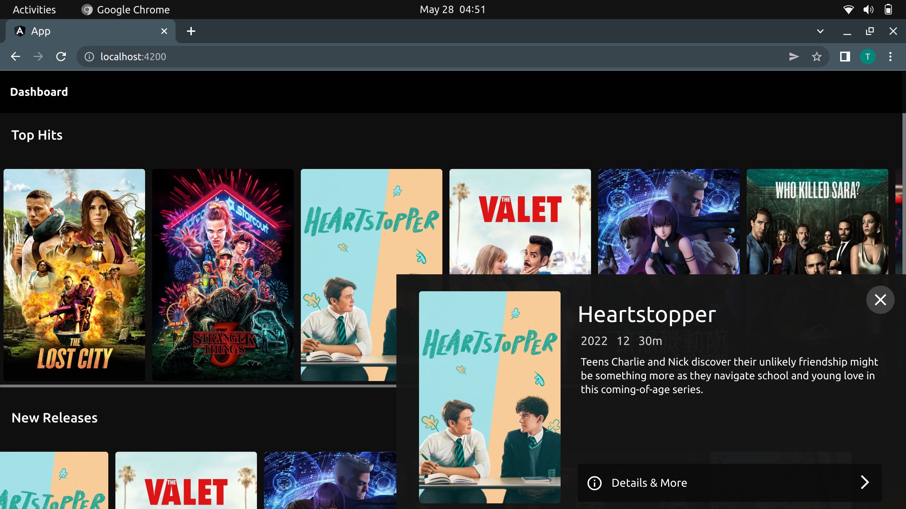
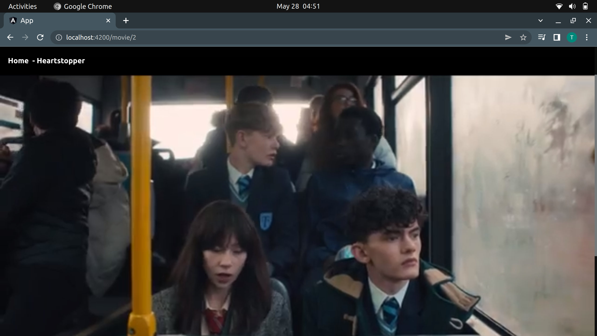
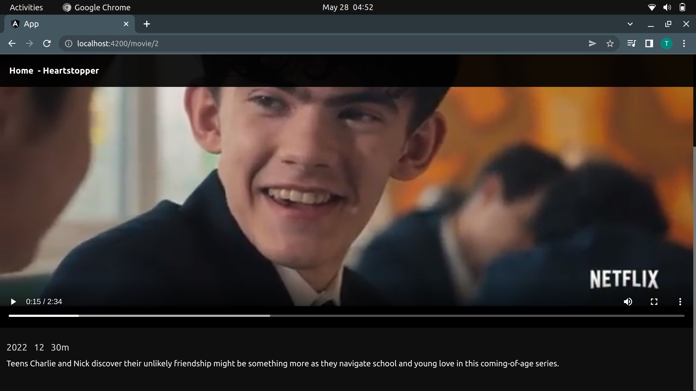

# Mean-stack-problem
- Server folder contains the API build in NodeJs
- App folder contains the applicaiton build in Angular 13

## Dependencies
- angular Cli verison 12+ (13.3.10)
- node version 12.2.9
- MongoDb package
- express package
- cors package

##Steps to run the Angular app
- Install angular @cli from https://angular.io/
- Open the app folder and run ``` npm install ``` It will install the npm packages.
- Run `ng serve` for a dev server. Navigate to `http://localhost:4200/`.  

##Steps to run the NodeJs API
- Install Node from https://nodejs.org/en/
- Open the server folder and run ``` node server.js ``` in the terminal 
- It will start listening on `http://localhost:8080`.

## My Thought process while solving the coding problem
- Which approach for data sharing would be best while working with the current data and for the future scallability.
- How can I make the UI and designs interactive with less and optimized data.
- To develop and implement an algorithm which will find the data related to movies over the web on different websites and will return the final data, which later can be used to serve our the websit, but piracy interrupted me while thinking

## Design Choices maded and why
- I choosen up a dark theme which is relaxing to eyes and gives and experience similar to one can memorize in theatre.
- I used containers with `display:flex ` property of css to make it responsive for each and every viewport.
- I created a small modal which opens up on bottom right, It gives a classic and royal feel to the user.

## How the solution can be optimized in the production mode
- I used google drive to store posters and trailers, In production mode we can use a fast, robust and reliable solution to serve data while compressing and encrypting the files for optimization and security.
- I used shared cluster in mongoDb to store data, In production mode we can use private cluster with a handson configuration, enabling load balancers for better solution.
- I writed a mvp version of this code not focusing much on the security, and optimization parts which can be improved in production mode.

## Potential designs issue in current code and how the can be improved
- Cards on the home page can be improved to attract audience, and to increase readibility and usability.
- More details can be shown in an attractive way to engage audience, which is lacking somwhere in current solution due to lack of data and designs.
- Movie page need to be optimized and redisgned to make it better than pre built solutions.

## Output








## Sample Api response

```
[
    {
        "_id": "628f65399d6925d350d945c4",
        "duration": "1h 52m",
        "rating": "PG-13",
        "summary": "A reclusive romance novelist was sure nothing could be worse than getting stuck on a book tour with her cover model until a kidnapping attempt sweeps them both into a cutthroat jungle adventure, proving life can be so much stranger, and more romantic, than any of her paperback fictions.",
        "title": "The Lost City",
        "year": "2022",
        "poster": "https://drive.google.com/uc?id=14xXb6adsAdpKbatQz1aT4TYLZMWend-v",
        "trailer": "https://drive.google.com/uc?id=1kK8B2sY4SCtwFIKng5v-nMaj4mv7sHfj"
    },
    {
        "_id": "628f67f5c58443d3dc0a744c",
        "duration": "50m",
        "rating": "TV-14",
        "summary": "When a young boy vanishes, a small town uncovers a mystery involving secret experiments, terrifying supernatural forces, and one strange little girl.",
        "title": "Stranger Things",
        "year": "2016",
        "poster": "https://drive.google.com/uc?id=1UzrDuCM208ZXMxPdS2Gq4tvJTGkfaC49",
        "trailer": "https://drive.google.com/uc?id=1WIaZj5HW9-v9kt9mPT2QIqcQINm0hVZT"
    },
    {
        "_id": "628f680bc58443d3dc0a744d",
        "duration": "30m",
        "rating": "12",
        "summary": "Teens Charlie and Nick discover their unlikely friendship might be something more as they navigate school and young love in this coming-of-age series.",
        "title": "Heartstopper",
        "year": "2022",
        "poster": "https://drive.google.com/uc?id=1udIRof0ibiyf65yS4gG1BsUW50L4LWBD",
        "trailer": "https://drive.google.com/uc?id=19Y3QrtVSTkaNLNGtC4NELclksrLEKSXI"
    }
]
```
